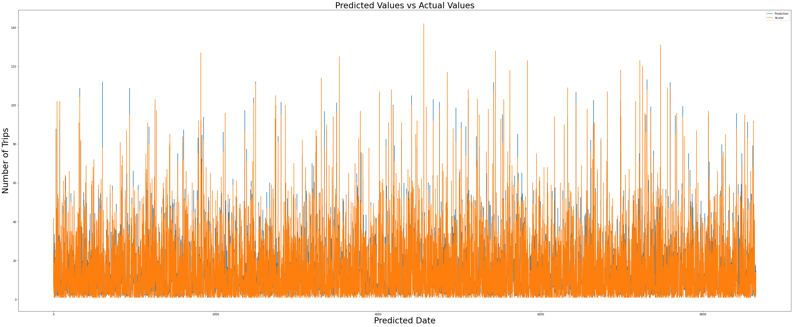
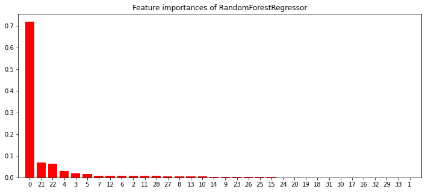

## Introduction
I am going to predict the number of borrowed bikes **in a given day and station** by using 4 available data set below.

- station.csv - Contains data that represents a station where users can pick up or return bikes.
- status.csv - Data about the number of bikes and docks available for a given station and minute.
- trips.csv - Data about individual bike trips.
- weather.csv - Data about the weather on a specific day for specific station id. 


## Hypothesis Generation

What could effect the people to rent a bike?

- Number of bikes
- Condition of the bikes
- Availablity of the bike roads around the station
- Daily Trend: weekdays as compared to weekend or holiday
- Hourly trend: office timings. Early morning and late evening 
- Rain: The demand of bikes will be lower on a rainy day as compared to a sunny day
- Temperature: I presume it may have positive correlation
- Pollution: government / company policies
- Traffic: Higher traffic may force people to use bike as compared to others

## Understanding the Data Set and EDA

I've already performed EDA on the data sets, you can access it via this [link](https://tanerceyhanli.github.io/Bike-Share-Assignment).


### Install Necessary Packages


```python
import pandas as pd
import numpy as np
from scipy.stats.stats import pearsonr  
from pandas.tseries.holiday import USFederalHolidayCalendar
from pandas.tseries.offsets import CustomBusinessDay
from datetime import datetime
from sklearn.model_selection import train_test_split
import math
import matplotlib.pyplot as plt
from sklearn.feature_selection import SelectKBest
from sklearn.pipeline import Pipeline
from sklearn.decomposition import PCA
from sklearn.pipeline import FeatureUnion
from sklearn.ensemble import RandomForestRegressor, GradientBoostingRegressor, AdaBoostRegressor
from sklearn.tree import DecisionTreeRegressor
from sklearn.linear_model import LogisticRegression
from sklearn.model_selection import cross_val_score
from sklearn.model_selection import KFold
from sklearn.metrics import mean_squared_error, median_absolute_error
from pandas.tseries.holiday import USFederalHolidayCalendar as calendar
from sklearn.preprocessing import LabelEncoder
from sklearn.preprocessing import StandardScaler
```

### Loading Data Sets


```python
df_trip = pd.read_csv("trip.csv")
df_station = pd.read_csv("station.csv")
df_weather = pd.read_csv("weather.csv")
```

### Station Data Set


```python
df_station
```


<div>
<style scoped>
    .dataframe tbody tr th:only-of-type {
        vertical-align: middle;
    }

    .dataframe tbody tr th {
        vertical-align: top;
    }

    .dataframe thead th {
        text-align: right;
    }
</style>
<table border="1" class="dataframe">
  <thead>
    <tr style="text-align: right;">
      <th></th>
      <th>id</th>
      <th>name</th>
      <th>lat</th>
      <th>long</th>
      <th>dock_count</th>
      <th>city</th>
      <th>installation_date</th>
    </tr>
  </thead>
  <tbody>
    <tr>
      <th>0</th>
      <td>2</td>
      <td>San Jose Diridon Caltrain Station</td>
      <td>37.329732</td>
      <td>-121.901782</td>
      <td>27</td>
      <td>San Jose</td>
      <td>8/6/2013</td>
    </tr>
    <tr>
      <th>1</th>
      <td>3</td>
      <td>San Jose Civic Center</td>
      <td>37.330698</td>
      <td>-121.888979</td>
      <td>15</td>
      <td>San Jose</td>
      <td>8/5/2013</td>
    </tr>
    <tr>
      <th>2</th>
      <td>4</td>
      <td>Santa Clara at Almaden</td>
      <td>37.333988</td>
      <td>-121.894902</td>
      <td>11</td>
      <td>San Jose</td>
      <td>8/6/2013</td>
    </tr>
    <tr>
      <th>3</th>
      <td>5</td>
      <td>Adobe on Almaden</td>
      <td>37.331415</td>
      <td>-121.893200</td>
      <td>19</td>
      <td>San Jose</td>
      <td>8/5/2013</td>
    </tr>
    <tr>
      <th>4</th>
      <td>6</td>
      <td>San Pedro Square</td>
      <td>37.336721</td>
      <td>-121.894074</td>
      <td>15</td>
      <td>San Jose</td>
      <td>8/7/2013</td>
    </tr>
    <tr>
      <th>...</th>
      <td>...</td>
      <td>...</td>
      <td>...</td>
      <td>...</td>
      <td>...</td>
      <td>...</td>
      <td>...</td>
    </tr>
    <tr>
      <th>65</th>
      <td>77</td>
      <td>Market at Sansome</td>
      <td>37.789625</td>
      <td>-122.400811</td>
      <td>27</td>
      <td>San Francisco</td>
      <td>8/25/2013</td>
    </tr>
    <tr>
      <th>66</th>
      <td>80</td>
      <td>Santa Clara County Civic Center</td>
      <td>37.352601</td>
      <td>-121.905733</td>
      <td>15</td>
      <td>San Jose</td>
      <td>12/31/2013</td>
    </tr>
    <tr>
      <th>67</th>
      <td>82</td>
      <td>Broadway St at Battery St</td>
      <td>37.798541</td>
      <td>-122.400862</td>
      <td>15</td>
      <td>San Francisco</td>
      <td>1/22/2014</td>
    </tr>
    <tr>
      <th>68</th>
      <td>83</td>
      <td>Mezes Park</td>
      <td>37.491269</td>
      <td>-122.236234</td>
      <td>15</td>
      <td>Redwood City</td>
      <td>2/20/2014</td>
    </tr>
    <tr>
      <th>69</th>
      <td>84</td>
      <td>Ryland Park</td>
      <td>37.342725</td>
      <td>-121.895617</td>
      <td>15</td>
      <td>San Jose</td>
      <td>4/9/2014</td>
    </tr>
  </tbody>
</table>
<p>70 rows × 7 columns</p>
</div>


```python
len(df_station.id.unique())
```


    70


#### There are 70 different stations.

### Trip Data Set


```python
# Have a look at first 5 instance
df_trip.head()
```


<div>
<style scoped>
    .dataframe tbody tr th:only-of-type {
        vertical-align: middle;
    }

    .dataframe tbody tr th {
        vertical-align: top;
    }

    .dataframe thead th {
        text-align: right;
    }
</style>
<table border="1" class="dataframe">
  <thead>
    <tr style="text-align: right;">
      <th></th>
      <th>id</th>
      <th>duration</th>
      <th>start_date</th>
      <th>start_station_name</th>
      <th>start_station_id</th>
      <th>end_date</th>
      <th>end_station_name</th>
      <th>end_station_id</th>
      <th>bike_id</th>
      <th>subscription_type</th>
      <th>zip_code</th>
    </tr>
  </thead>
  <tbody>
    <tr>
      <th>0</th>
      <td>4576</td>
      <td>63</td>
      <td>8/29/2013 14:13</td>
      <td>South Van Ness at Market</td>
      <td>66</td>
      <td>8/29/2013 14:14</td>
      <td>South Van Ness at Market</td>
      <td>66</td>
      <td>520</td>
      <td>Subscriber</td>
      <td>94127</td>
    </tr>
    <tr>
      <th>1</th>
      <td>4607</td>
      <td>70</td>
      <td>8/29/2013 14:42</td>
      <td>San Jose City Hall</td>
      <td>10</td>
      <td>8/29/2013 14:43</td>
      <td>San Jose City Hall</td>
      <td>10</td>
      <td>661</td>
      <td>Subscriber</td>
      <td>95138</td>
    </tr>
    <tr>
      <th>2</th>
      <td>4130</td>
      <td>71</td>
      <td>8/29/2013 10:16</td>
      <td>Mountain View City Hall</td>
      <td>27</td>
      <td>8/29/2013 10:17</td>
      <td>Mountain View City Hall</td>
      <td>27</td>
      <td>48</td>
      <td>Subscriber</td>
      <td>97214</td>
    </tr>
    <tr>
      <th>3</th>
      <td>4251</td>
      <td>77</td>
      <td>8/29/2013 11:29</td>
      <td>San Jose City Hall</td>
      <td>10</td>
      <td>8/29/2013 11:30</td>
      <td>San Jose City Hall</td>
      <td>10</td>
      <td>26</td>
      <td>Subscriber</td>
      <td>95060</td>
    </tr>
    <tr>
      <th>4</th>
      <td>4299</td>
      <td>83</td>
      <td>8/29/2013 12:02</td>
      <td>South Van Ness at Market</td>
      <td>66</td>
      <td>8/29/2013 12:04</td>
      <td>Market at 10th</td>
      <td>67</td>
      <td>319</td>
      <td>Subscriber</td>
      <td>94103</td>
    </tr>
  </tbody>
</table>
</div>


```python
# Number of instance and variables
df_trip.shape
```


    (669959, 11)


```python
# Checking for Missing Values
df_trip.isnull().sum()
```


    id                       0
    duration                 0
    start_date               0
    start_station_name       0
    start_station_id         0
    end_date                 0
    end_station_name         0
    end_station_id           0
    bike_id                  0
    subscription_type        0
    zip_code              6619
    dtype: int64


```python
#Check dtypes
df_trip.info()
```

    <class 'pandas.core.frame.DataFrame'>
    RangeIndex: 669959 entries, 0 to 669958
    Data columns (total 11 columns):
     #   Column              Non-Null Count   Dtype 
    ---  ------              --------------   ----- 
     0   id                  669959 non-null  int64 
     1   duration            669959 non-null  int64 
     2   start_date          669959 non-null  object
     3   start_station_name  669959 non-null  object
     4   start_station_id    669959 non-null  int64 
     5   end_date            669959 non-null  object
     6   end_station_name    669959 non-null  object
     7   end_station_id      669959 non-null  int64 
     8   bike_id             669959 non-null  int64 
     9   subscription_type   669959 non-null  object
     10  zip_code            663340 non-null  object
    dtypes: int64(5), object(6)
    memory usage: 56.2+ MB
    


```python
#Create a new variable date from start_date
df_trip['date'] = df_trip.start_date
df_trip.date = pd.to_datetime(df_trip.start_date, format='%m/%d/%Y %H:%M')
df_trip['date'] = pd.to_datetime(df_trip['date'])
```


```python
# Summary statistics
df_trip.describe()
```


<div>
<style scoped>
    .dataframe tbody tr th:only-of-type {
        vertical-align: middle;
    }

    .dataframe tbody tr th {
        vertical-align: top;
    }

    .dataframe thead th {
        text-align: right;
    }
</style>
<table border="1" class="dataframe">
  <thead>
    <tr style="text-align: right;">
      <th></th>
      <th>id</th>
      <th>duration</th>
      <th>start_station_id</th>
      <th>end_station_id</th>
      <th>bike_id</th>
    </tr>
  </thead>
  <tbody>
    <tr>
      <th>count</th>
      <td>669959.000000</td>
      <td>6.699590e+05</td>
      <td>669959.000000</td>
      <td>669959.000000</td>
      <td>669959.000000</td>
    </tr>
    <tr>
      <th>mean</th>
      <td>460382.009899</td>
      <td>1.107950e+03</td>
      <td>57.851876</td>
      <td>57.837438</td>
      <td>427.587620</td>
    </tr>
    <tr>
      <th>std</th>
      <td>264584.458487</td>
      <td>2.225544e+04</td>
      <td>17.112474</td>
      <td>17.200142</td>
      <td>153.450988</td>
    </tr>
    <tr>
      <th>min</th>
      <td>4069.000000</td>
      <td>6.000000e+01</td>
      <td>2.000000</td>
      <td>2.000000</td>
      <td>9.000000</td>
    </tr>
    <tr>
      <th>25%</th>
      <td>231082.500000</td>
      <td>3.440000e+02</td>
      <td>50.000000</td>
      <td>50.000000</td>
      <td>334.000000</td>
    </tr>
    <tr>
      <th>50%</th>
      <td>459274.000000</td>
      <td>5.170000e+02</td>
      <td>62.000000</td>
      <td>62.000000</td>
      <td>440.000000</td>
    </tr>
    <tr>
      <th>75%</th>
      <td>692601.000000</td>
      <td>7.550000e+02</td>
      <td>70.000000</td>
      <td>70.000000</td>
      <td>546.000000</td>
    </tr>
    <tr>
      <th>max</th>
      <td>913460.000000</td>
      <td>1.727040e+07</td>
      <td>84.000000</td>
      <td>84.000000</td>
      <td>878.000000</td>
    </tr>
  </tbody>
</table>
</div>


### Weather


```python
df_weather
```


<div>
<style scoped>
    .dataframe tbody tr th:only-of-type {
        vertical-align: middle;
    }

    .dataframe tbody tr th {
        vertical-align: top;
    }

    .dataframe thead th {
        text-align: right;
    }
</style>
<table border="1" class="dataframe">
  <thead>
    <tr style="text-align: right;">
      <th></th>
      <th>date</th>
      <th>start_station_id</th>
      <th>zip_code</th>
      <th>mean_temperature_f</th>
      <th>min_temperature_f</th>
      <th>mean_humidity</th>
      <th>max_humidity</th>
      <th>mean_visibility_miles</th>
      <th>min_visibility_miles</th>
      <th>max_wind_Speed_mph</th>
      <th>max_gust_speed_mph</th>
      <th>precipitation_inches</th>
      <th>events</th>
    </tr>
  </thead>
  <tbody>
    <tr>
      <th>0</th>
      <td>2013-08-29</td>
      <td>27</td>
      <td>94107</td>
      <td>68.0</td>
      <td>61.0</td>
      <td>75.0</td>
      <td>93.0</td>
      <td>10.0</td>
      <td>10.0</td>
      <td>23.0</td>
      <td>28.0</td>
      <td>0.0</td>
      <td>NaN</td>
    </tr>
    <tr>
      <th>1</th>
      <td>2013-08-29</td>
      <td>39</td>
      <td>94107</td>
      <td>68.0</td>
      <td>61.0</td>
      <td>75.0</td>
      <td>93.0</td>
      <td>10.0</td>
      <td>10.0</td>
      <td>23.0</td>
      <td>28.0</td>
      <td>0.0</td>
      <td>NaN</td>
    </tr>
    <tr>
      <th>2</th>
      <td>2013-08-29</td>
      <td>41</td>
      <td>94107</td>
      <td>68.0</td>
      <td>61.0</td>
      <td>75.0</td>
      <td>93.0</td>
      <td>10.0</td>
      <td>10.0</td>
      <td>23.0</td>
      <td>28.0</td>
      <td>0.0</td>
      <td>NaN</td>
    </tr>
    <tr>
      <th>3</th>
      <td>2013-08-29</td>
      <td>47</td>
      <td>94107</td>
      <td>68.0</td>
      <td>61.0</td>
      <td>75.0</td>
      <td>93.0</td>
      <td>10.0</td>
      <td>10.0</td>
      <td>23.0</td>
      <td>28.0</td>
      <td>0.0</td>
      <td>NaN</td>
    </tr>
    <tr>
      <th>4</th>
      <td>2013-08-29</td>
      <td>48</td>
      <td>94107</td>
      <td>68.0</td>
      <td>61.0</td>
      <td>75.0</td>
      <td>93.0</td>
      <td>10.0</td>
      <td>10.0</td>
      <td>23.0</td>
      <td>28.0</td>
      <td>0.0</td>
      <td>NaN</td>
    </tr>
    <tr>
      <th>...</th>
      <td>...</td>
      <td>...</td>
      <td>...</td>
      <td>...</td>
      <td>...</td>
      <td>...</td>
      <td>...</td>
      <td>...</td>
      <td>...</td>
      <td>...</td>
      <td>...</td>
      <td>...</td>
      <td>...</td>
    </tr>
    <tr>
      <th>52038</th>
      <td>2015-08-31</td>
      <td>71</td>
      <td>94109</td>
      <td>70.8</td>
      <td>60.2</td>
      <td>63.8</td>
      <td>82.2</td>
      <td>11.4</td>
      <td>9.8</td>
      <td>19.0</td>
      <td>22.5</td>
      <td>0.0</td>
      <td>NaN</td>
    </tr>
    <tr>
      <th>52039</th>
      <td>2015-08-31</td>
      <td>66</td>
      <td>94103</td>
      <td>70.8</td>
      <td>60.2</td>
      <td>63.8</td>
      <td>82.2</td>
      <td>11.4</td>
      <td>9.8</td>
      <td>19.0</td>
      <td>22.5</td>
      <td>0.0</td>
      <td>NaN</td>
    </tr>
    <tr>
      <th>52040</th>
      <td>2015-08-31</td>
      <td>67</td>
      <td>94103</td>
      <td>70.8</td>
      <td>60.2</td>
      <td>63.8</td>
      <td>82.2</td>
      <td>11.4</td>
      <td>9.8</td>
      <td>19.0</td>
      <td>22.5</td>
      <td>0.0</td>
      <td>NaN</td>
    </tr>
    <tr>
      <th>52041</th>
      <td>2015-08-31</td>
      <td>72</td>
      <td>94103</td>
      <td>70.8</td>
      <td>60.2</td>
      <td>63.8</td>
      <td>82.2</td>
      <td>11.4</td>
      <td>9.8</td>
      <td>19.0</td>
      <td>22.5</td>
      <td>0.0</td>
      <td>NaN</td>
    </tr>
    <tr>
      <th>52042</th>
      <td>2015-08-31</td>
      <td>25</td>
      <td>95037</td>
      <td>70.8</td>
      <td>60.2</td>
      <td>63.8</td>
      <td>82.2</td>
      <td>11.4</td>
      <td>9.8</td>
      <td>19.0</td>
      <td>22.5</td>
      <td>0.0</td>
      <td>NaN</td>
    </tr>
  </tbody>
</table>
<p>52043 rows × 13 columns</p>
</div>


```python
df_weather.events.unique()
```


    array([nan, 'Fog', 'Rain', 'Fog-Rain', 'rain', 'Rain-Thunderstorm'],
          dtype=object)


```python
df_weather.loc[df_weather.events == 'rain', 'events'] = "Rain"
df_weather.loc[df_weather.events.isnull(), 'events'] = "Normal"
```


```python
df_weather.isnull().sum()
```


    date                       0
    start_station_id           0
    zip_code                   0
    mean_temperature_f         0
    min_temperature_f          5
    mean_humidity              0
    max_humidity             105
    mean_visibility_miles      0
    min_visibility_miles      26
    max_wind_Speed_mph         0
    max_gust_speed_mph         2
    precipitation_inches     252
    events                     0
    dtype: int64


```python
#Fill null cells with lambda
df_weather = df_weather.apply(lambda x:x.fillna(x.value_counts().index[0]))
```


```python
df_weather.isnull().sum()
```


    date                     0
    start_station_id         0
    zip_code                 0
    mean_temperature_f       0
    min_temperature_f        0
    mean_humidity            0
    max_humidity             0
    mean_visibility_miles    0
    min_visibility_miles     0
    max_wind_Speed_mph       0
    max_gust_speed_mph       0
    precipitation_inches     0
    events                   0
    dtype: int64


## Data Preparation

- Prepare data set for prediction based on df_trip dataframe
- Drop unnecessary variables
- Data set should countain date and total number of daily trips from each stations
- Day,Mount,Year,Weekday,Holiday,Season variables need to be added
- Station data should be merged
- Weather data should be merged


```python
#Drop unnecessary variables
df= df_trip.drop(['id','duration','start_date','start_station_name','end_date', 'end_station_name','end_station_id','bike_id','subscription_type', 'zip_code'], 1)
```


```python
#Number of trips variable
df['date'] = df.date.dt.date
df = df.value_counts().to_frame('no_of_trips').reset_index()

#Sort by date
df = df.sort_values(by=['date'])
df.reset_index(drop=True, inplace=True)

df.head()
```


<div>
<style scoped>
    .dataframe tbody tr th:only-of-type {
        vertical-align: middle;
    }

    .dataframe tbody tr th {
        vertical-align: top;
    }

    .dataframe thead th {
        text-align: right;
    }
</style>
<table border="1" class="dataframe">
  <thead>
    <tr style="text-align: right;">
      <th></th>
      <th>start_station_id</th>
      <th>date</th>
      <th>no_of_trips</th>
    </tr>
  </thead>
  <tbody>
    <tr>
      <th>0</th>
      <td>22</td>
      <td>2013-08-29</td>
      <td>5</td>
    </tr>
    <tr>
      <th>1</th>
      <td>13</td>
      <td>2013-08-29</td>
      <td>4</td>
    </tr>
    <tr>
      <th>2</th>
      <td>30</td>
      <td>2013-08-29</td>
      <td>1</td>
    </tr>
    <tr>
      <th>3</th>
      <td>49</td>
      <td>2013-08-29</td>
      <td>18</td>
    </tr>
    <tr>
      <th>4</th>
      <td>55</td>
      <td>2013-08-29</td>
      <td>6</td>
    </tr>
  </tbody>
</table>
</div>


```python
# We will make daily predictions, hours is not important
df['year'] = df_trip['date'].dt.year
df['month'] = df_trip['date'].dt.month
df['day'] = df_trip['date'].dt.day

# Variables added
df.info()
```

    <class 'pandas.core.frame.DataFrame'>
    RangeIndex: 43270 entries, 0 to 43269
    Data columns (total 6 columns):
     #   Column            Non-Null Count  Dtype 
    ---  ------            --------------  ----- 
     0   start_station_id  43270 non-null  int64 
     1   date              43270 non-null  object
     2   no_of_trips       43270 non-null  int64 
     3   year              43270 non-null  int64 
     4   month             43270 non-null  int64 
     5   day               43270 non-null  int64 
    dtypes: int64(5), object(1)
    memory usage: 2.0+ MB
    


```python
#Day name of the week
df['date'] = pd.to_datetime(df['date'])
df['day_name'] = df['date'].dt.day_name()
```


```python
#Weekend
df['weekend'] = df['weekend'] = df['date'].dt.dayofweek > 4
df['weekend'] = df['weekend'].astype(object)
```


```python
#Season variable
df['season'] = (df['date'].dt.month%12 + 3)//3

seasons = {
             1: 'Winter',
             2: 'Spring',
             3: 'Summer',
             4: 'Autumn'
}

df['season'] = df['season'].map(seasons)
```


```python
#Find holidays
cal = calendar()
dr = pd.date_range(start='2013-07-01', end='2016-07-31')
holidays = cal.holidays(start=dr.min(), end=dr.max())
```


```python
#Holiday variable
df['holiday'] = df['date'].dt.date.astype('datetime64').isin(holidays)
df['holiday'] = df['holiday'].astype(object)
```


```python
# allign dtypes before merge
df['date'] = pd.to_datetime(df['date'])
df_station['installation_date'] = pd.to_datetime(df_station['installation_date'])
df_weather['date'] = pd.to_datetime(df_weather['date'])
```


```python
#merge trips and station data
no_of_docks = []
for day in df.date:
    no_of_docks.append(sum(df_station[df_station.installation_date <= day].dock_count))
    
df['no_of_docks'] = no_of_docks
```


```python
#merge trips and weather data
df = pd.merge(df, df_weather, on=['start_station_id','date'], how='left')

df.head()
```


<div>
<style scoped>
    .dataframe tbody tr th:only-of-type {
        vertical-align: middle;
    }

    .dataframe tbody tr th {
        vertical-align: top;
    }

    .dataframe thead th {
        text-align: right;
    }
</style>
<table border="1" class="dataframe">
  <thead>
    <tr style="text-align: right;">
      <th></th>
      <th>start_station_id</th>
      <th>date</th>
      <th>no_of_trips</th>
      <th>year</th>
      <th>month</th>
      <th>day</th>
      <th>day_name</th>
      <th>weekend</th>
      <th>season</th>
      <th>holiday</th>
      <th>...</th>
      <th>mean_temperature_f</th>
      <th>min_temperature_f</th>
      <th>mean_humidity</th>
      <th>max_humidity</th>
      <th>mean_visibility_miles</th>
      <th>min_visibility_miles</th>
      <th>max_wind_Speed_mph</th>
      <th>max_gust_speed_mph</th>
      <th>precipitation_inches</th>
      <th>events</th>
    </tr>
  </thead>
  <tbody>
    <tr>
      <th>0</th>
      <td>22</td>
      <td>2013-08-29</td>
      <td>5</td>
      <td>2013</td>
      <td>8</td>
      <td>29</td>
      <td>Thursday</td>
      <td>False</td>
      <td>Summer</td>
      <td>False</td>
      <td>...</td>
      <td>71.0</td>
      <td>62.0</td>
      <td>79.0</td>
      <td>94.0</td>
      <td>10.0</td>
      <td>10.0</td>
      <td>14.0</td>
      <td>17.0</td>
      <td>0.0</td>
      <td>Normal</td>
    </tr>
    <tr>
      <th>1</th>
      <td>13</td>
      <td>2013-08-29</td>
      <td>4</td>
      <td>2013</td>
      <td>8</td>
      <td>29</td>
      <td>Thursday</td>
      <td>False</td>
      <td>Summer</td>
      <td>False</td>
      <td>...</td>
      <td>70.4</td>
      <td>62.8</td>
      <td>73.2</td>
      <td>88.8</td>
      <td>10.0</td>
      <td>10.0</td>
      <td>17.8</td>
      <td>21.6</td>
      <td>0.0</td>
      <td>Normal</td>
    </tr>
    <tr>
      <th>2</th>
      <td>30</td>
      <td>2013-08-29</td>
      <td>1</td>
      <td>2013</td>
      <td>8</td>
      <td>29</td>
      <td>Thursday</td>
      <td>False</td>
      <td>Summer</td>
      <td>False</td>
      <td>...</td>
      <td>70.4</td>
      <td>62.8</td>
      <td>73.2</td>
      <td>88.8</td>
      <td>10.0</td>
      <td>10.0</td>
      <td>17.8</td>
      <td>21.6</td>
      <td>0.0</td>
      <td>Normal</td>
    </tr>
    <tr>
      <th>3</th>
      <td>49</td>
      <td>2013-08-29</td>
      <td>18</td>
      <td>2013</td>
      <td>8</td>
      <td>29</td>
      <td>Thursday</td>
      <td>False</td>
      <td>Summer</td>
      <td>False</td>
      <td>...</td>
      <td>70.4</td>
      <td>62.8</td>
      <td>73.2</td>
      <td>88.8</td>
      <td>10.0</td>
      <td>10.0</td>
      <td>17.8</td>
      <td>21.6</td>
      <td>0.0</td>
      <td>Normal</td>
    </tr>
    <tr>
      <th>4</th>
      <td>55</td>
      <td>2013-08-29</td>
      <td>6</td>
      <td>2013</td>
      <td>8</td>
      <td>29</td>
      <td>Thursday</td>
      <td>False</td>
      <td>Summer</td>
      <td>False</td>
      <td>...</td>
      <td>70.4</td>
      <td>62.8</td>
      <td>73.2</td>
      <td>88.8</td>
      <td>10.0</td>
      <td>10.0</td>
      <td>17.8</td>
      <td>21.6</td>
      <td>0.0</td>
      <td>Normal</td>
    </tr>
  </tbody>
</table>
<p>5 rows × 22 columns</p>
</div>


```python
df.info()
```

    <class 'pandas.core.frame.DataFrame'>
    Int64Index: 43270 entries, 0 to 43269
    Data columns (total 22 columns):
     #   Column                 Non-Null Count  Dtype         
    ---  ------                 --------------  -----         
     0   start_station_id       43270 non-null  int64         
     1   date                   43270 non-null  datetime64[ns]
     2   no_of_trips            43270 non-null  int64         
     3   year                   43270 non-null  int64         
     4   month                  43270 non-null  int64         
     5   day                    43270 non-null  int64         
     6   day_name               43270 non-null  object        
     7   weekend                43270 non-null  object        
     8   season                 43270 non-null  object        
     9   holiday                43270 non-null  object        
     10  no_of_docks            43270 non-null  int64         
     11  zip_code               43270 non-null  int64         
     12  mean_temperature_f     43270 non-null  float64       
     13  min_temperature_f      43270 non-null  float64       
     14  mean_humidity          43270 non-null  float64       
     15  max_humidity           43270 non-null  float64       
     16  mean_visibility_miles  43270 non-null  float64       
     17  min_visibility_miles   43270 non-null  float64       
     18  max_wind_Speed_mph     43270 non-null  float64       
     19  max_gust_speed_mph     43270 non-null  float64       
     20  precipitation_inches   43270 non-null  float64       
     21  events                 43270 non-null  object        
    dtypes: datetime64[ns](1), float64(9), int64(7), object(5)
    memory usage: 7.6+ MB
    

## Feature Engineering

### Standard Scaler for continous variables


```python
scaler = StandardScaler()
df[['no_of_docks','mean_temperature_f', 'min_temperature_f', 'mean_humidity', 'max_humidity','mean_visibility_miles', 'min_visibility_miles', 'max_wind_Speed_mph', 'max_gust_speed_mph','max_gust_speed_mph']]=scaler.fit_transform(df[['no_of_docks','mean_temperature_f', 'min_temperature_f', 'mean_humidity', 'max_humidity','mean_visibility_miles', 'min_visibility_miles', 'max_wind_Speed_mph', 'max_gust_speed_mph','max_gust_speed_mph']].to_numpy())
df
```


<div>
<style scoped>
    .dataframe tbody tr th:only-of-type {
        vertical-align: middle;
    }

    .dataframe tbody tr th {
        vertical-align: top;
    }

    .dataframe thead th {
        text-align: right;
    }
</style>
<table border="1" class="dataframe">
  <thead>
    <tr style="text-align: right;">
      <th></th>
      <th>start_station_id</th>
      <th>date</th>
      <th>no_of_trips</th>
      <th>year</th>
      <th>month</th>
      <th>day</th>
      <th>day_name</th>
      <th>weekend</th>
      <th>season</th>
      <th>holiday</th>
      <th>...</th>
      <th>mean_temperature_f</th>
      <th>min_temperature_f</th>
      <th>mean_humidity</th>
      <th>max_humidity</th>
      <th>mean_visibility_miles</th>
      <th>min_visibility_miles</th>
      <th>max_wind_Speed_mph</th>
      <th>max_gust_speed_mph</th>
      <th>precipitation_inches</th>
      <th>events</th>
    </tr>
  </thead>
  <tbody>
    <tr>
      <th>0</th>
      <td>22</td>
      <td>2013-08-29</td>
      <td>5</td>
      <td>2013</td>
      <td>8</td>
      <td>29</td>
      <td>Thursday</td>
      <td>False</td>
      <td>Summer</td>
      <td>False</td>
      <td>...</td>
      <td>1.431242</td>
      <td>1.424143</td>
      <td>1.100845</td>
      <td>1.025795</td>
      <td>0.214677</td>
      <td>0.695694</td>
      <td>-0.568521</td>
      <td>-0.581315</td>
      <td>0.0</td>
      <td>Normal</td>
    </tr>
    <tr>
      <th>1</th>
      <td>13</td>
      <td>2013-08-29</td>
      <td>4</td>
      <td>2013</td>
      <td>8</td>
      <td>29</td>
      <td>Thursday</td>
      <td>False</td>
      <td>Summer</td>
      <td>False</td>
      <td>...</td>
      <td>1.342652</td>
      <td>1.539740</td>
      <td>0.542780</td>
      <td>0.393064</td>
      <td>0.214677</td>
      <td>0.695694</td>
      <td>0.117123</td>
      <td>0.001171</td>
      <td>0.0</td>
      <td>Normal</td>
    </tr>
    <tr>
      <th>2</th>
      <td>30</td>
      <td>2013-08-29</td>
      <td>1</td>
      <td>2013</td>
      <td>8</td>
      <td>29</td>
      <td>Thursday</td>
      <td>False</td>
      <td>Summer</td>
      <td>False</td>
      <td>...</td>
      <td>1.342652</td>
      <td>1.539740</td>
      <td>0.542780</td>
      <td>0.393064</td>
      <td>0.214677</td>
      <td>0.695694</td>
      <td>0.117123</td>
      <td>0.001171</td>
      <td>0.0</td>
      <td>Normal</td>
    </tr>
    <tr>
      <th>3</th>
      <td>49</td>
      <td>2013-08-29</td>
      <td>18</td>
      <td>2013</td>
      <td>8</td>
      <td>29</td>
      <td>Thursday</td>
      <td>False</td>
      <td>Summer</td>
      <td>False</td>
      <td>...</td>
      <td>1.342652</td>
      <td>1.539740</td>
      <td>0.542780</td>
      <td>0.393064</td>
      <td>0.214677</td>
      <td>0.695694</td>
      <td>0.117123</td>
      <td>0.001171</td>
      <td>0.0</td>
      <td>Normal</td>
    </tr>
    <tr>
      <th>4</th>
      <td>55</td>
      <td>2013-08-29</td>
      <td>6</td>
      <td>2013</td>
      <td>8</td>
      <td>29</td>
      <td>Thursday</td>
      <td>False</td>
      <td>Summer</td>
      <td>False</td>
      <td>...</td>
      <td>1.342652</td>
      <td>1.539740</td>
      <td>0.542780</td>
      <td>0.393064</td>
      <td>0.214677</td>
      <td>0.695694</td>
      <td>0.117123</td>
      <td>0.001171</td>
      <td>0.0</td>
      <td>Normal</td>
    </tr>
    <tr>
      <th>...</th>
      <td>...</td>
      <td>...</td>
      <td>...</td>
      <td>...</td>
      <td>...</td>
      <td>...</td>
      <td>...</td>
      <td>...</td>
      <td>...</td>
      <td>...</td>
      <td>...</td>
      <td>...</td>
      <td>...</td>
      <td>...</td>
      <td>...</td>
      <td>...</td>
      <td>...</td>
      <td>...</td>
      <td>...</td>
      <td>...</td>
      <td>...</td>
    </tr>
    <tr>
      <th>43265</th>
      <td>9</td>
      <td>2015-08-31</td>
      <td>2</td>
      <td>2013</td>
      <td>10</td>
      <td>17</td>
      <td>Monday</td>
      <td>False</td>
      <td>Summer</td>
      <td>False</td>
      <td>...</td>
      <td>1.401712</td>
      <td>1.164050</td>
      <td>-0.361670</td>
      <td>-0.410016</td>
      <td>1.472286</td>
      <td>0.619260</td>
      <td>0.333642</td>
      <td>0.115136</td>
      <td>0.0</td>
      <td>Normal</td>
    </tr>
    <tr>
      <th>43266</th>
      <td>7</td>
      <td>2015-08-31</td>
      <td>2</td>
      <td>2013</td>
      <td>10</td>
      <td>17</td>
      <td>Monday</td>
      <td>False</td>
      <td>Summer</td>
      <td>False</td>
      <td>...</td>
      <td>1.401712</td>
      <td>1.164050</td>
      <td>-0.361670</td>
      <td>-0.410016</td>
      <td>1.472286</td>
      <td>0.619260</td>
      <td>0.333642</td>
      <td>0.115136</td>
      <td>0.0</td>
      <td>Normal</td>
    </tr>
    <tr>
      <th>43267</th>
      <td>22</td>
      <td>2015-08-31</td>
      <td>5</td>
      <td>2013</td>
      <td>10</td>
      <td>17</td>
      <td>Monday</td>
      <td>False</td>
      <td>Summer</td>
      <td>False</td>
      <td>...</td>
      <td>1.431242</td>
      <td>1.424143</td>
      <td>-0.053772</td>
      <td>-1.042746</td>
      <td>0.214677</td>
      <td>0.695694</td>
      <td>0.153210</td>
      <td>-0.201433</td>
      <td>0.0</td>
      <td>Normal</td>
    </tr>
    <tr>
      <th>43268</th>
      <td>77</td>
      <td>2015-08-31</td>
      <td>49</td>
      <td>2013</td>
      <td>10</td>
      <td>17</td>
      <td>Monday</td>
      <td>False</td>
      <td>Summer</td>
      <td>False</td>
      <td>...</td>
      <td>1.135943</td>
      <td>1.135151</td>
      <td>-0.053772</td>
      <td>-0.190994</td>
      <td>0.214677</td>
      <td>0.313523</td>
      <td>0.153210</td>
      <td>-0.074805</td>
      <td>0.0</td>
      <td>Normal</td>
    </tr>
    <tr>
      <th>43269</th>
      <td>42</td>
      <td>2015-08-31</td>
      <td>30</td>
      <td>2013</td>
      <td>10</td>
      <td>17</td>
      <td>Monday</td>
      <td>False</td>
      <td>Summer</td>
      <td>False</td>
      <td>...</td>
      <td>1.401712</td>
      <td>1.164050</td>
      <td>-0.361670</td>
      <td>-0.410016</td>
      <td>1.472286</td>
      <td>0.619260</td>
      <td>0.333642</td>
      <td>0.115136</td>
      <td>0.0</td>
      <td>Normal</td>
    </tr>
  </tbody>
</table>
<p>43270 rows × 22 columns</p>
</div>


### One hot encoding for categorical variables


```python

# Making dummy variables for categorical data with more inputs.  
data_dummy = pd.get_dummies(df[['day_name','weekend','season', 'holiday', 'events']])

# Output the first five rows.
data_dummy.head()

```


<div>
<style scoped>
    .dataframe tbody tr th:only-of-type {
        vertical-align: middle;
    }

    .dataframe tbody tr th {
        vertical-align: top;
    }

    .dataframe thead th {
        text-align: right;
    }
</style>
<table border="1" class="dataframe">
  <thead>
    <tr style="text-align: right;">
      <th></th>
      <th>day_name_Friday</th>
      <th>day_name_Monday</th>
      <th>day_name_Saturday</th>
      <th>day_name_Sunday</th>
      <th>day_name_Thursday</th>
      <th>day_name_Tuesday</th>
      <th>day_name_Wednesday</th>
      <th>weekend_False</th>
      <th>weekend_True</th>
      <th>season_Autumn</th>
      <th>season_Spring</th>
      <th>season_Summer</th>
      <th>season_Winter</th>
      <th>holiday_False</th>
      <th>holiday_True</th>
      <th>events_Fog</th>
      <th>events_Fog-Rain</th>
      <th>events_Normal</th>
      <th>events_Rain</th>
      <th>events_Rain-Thunderstorm</th>
    </tr>
  </thead>
  <tbody>
    <tr>
      <th>0</th>
      <td>0</td>
      <td>0</td>
      <td>0</td>
      <td>0</td>
      <td>1</td>
      <td>0</td>
      <td>0</td>
      <td>1</td>
      <td>0</td>
      <td>0</td>
      <td>0</td>
      <td>1</td>
      <td>0</td>
      <td>1</td>
      <td>0</td>
      <td>0</td>
      <td>0</td>
      <td>1</td>
      <td>0</td>
      <td>0</td>
    </tr>
    <tr>
      <th>1</th>
      <td>0</td>
      <td>0</td>
      <td>0</td>
      <td>0</td>
      <td>1</td>
      <td>0</td>
      <td>0</td>
      <td>1</td>
      <td>0</td>
      <td>0</td>
      <td>0</td>
      <td>1</td>
      <td>0</td>
      <td>1</td>
      <td>0</td>
      <td>0</td>
      <td>0</td>
      <td>1</td>
      <td>0</td>
      <td>0</td>
    </tr>
    <tr>
      <th>2</th>
      <td>0</td>
      <td>0</td>
      <td>0</td>
      <td>0</td>
      <td>1</td>
      <td>0</td>
      <td>0</td>
      <td>1</td>
      <td>0</td>
      <td>0</td>
      <td>0</td>
      <td>1</td>
      <td>0</td>
      <td>1</td>
      <td>0</td>
      <td>0</td>
      <td>0</td>
      <td>1</td>
      <td>0</td>
      <td>0</td>
    </tr>
    <tr>
      <th>3</th>
      <td>0</td>
      <td>0</td>
      <td>0</td>
      <td>0</td>
      <td>1</td>
      <td>0</td>
      <td>0</td>
      <td>1</td>
      <td>0</td>
      <td>0</td>
      <td>0</td>
      <td>1</td>
      <td>0</td>
      <td>1</td>
      <td>0</td>
      <td>0</td>
      <td>0</td>
      <td>1</td>
      <td>0</td>
      <td>0</td>
    </tr>
    <tr>
      <th>4</th>
      <td>0</td>
      <td>0</td>
      <td>0</td>
      <td>0</td>
      <td>1</td>
      <td>0</td>
      <td>0</td>
      <td>1</td>
      <td>0</td>
      <td>0</td>
      <td>0</td>
      <td>1</td>
      <td>0</td>
      <td>1</td>
      <td>0</td>
      <td>0</td>
      <td>0</td>
      <td>1</td>
      <td>0</td>
      <td>0</td>
    </tr>
  </tbody>
</table>
</div>


```python
# Merging (concatenate) original data frame with 'dummy' dataframe.
df = pd.concat([df,data_dummy], axis=1)
```


```python
# Dropping attributes for which we made dummy variables and zip_code
df = df.drop(['day_name','weekend','season', 'holiday', 'events','zip_code'], axis=1)
df.head()
```


<div>
<style scoped>
    .dataframe tbody tr th:only-of-type {
        vertical-align: middle;
    }

    .dataframe tbody tr th {
        vertical-align: top;
    }

    .dataframe thead th {
        text-align: right;
    }
</style>
<table border="1" class="dataframe">
  <thead>
    <tr style="text-align: right;">
      <th></th>
      <th>start_station_id</th>
      <th>date</th>
      <th>no_of_trips</th>
      <th>year</th>
      <th>month</th>
      <th>day</th>
      <th>no_of_docks</th>
      <th>mean_temperature_f</th>
      <th>min_temperature_f</th>
      <th>mean_humidity</th>
      <th>...</th>
      <th>season_Spring</th>
      <th>season_Summer</th>
      <th>season_Winter</th>
      <th>holiday_False</th>
      <th>holiday_True</th>
      <th>events_Fog</th>
      <th>events_Fog-Rain</th>
      <th>events_Normal</th>
      <th>events_Rain</th>
      <th>events_Rain-Thunderstorm</th>
    </tr>
  </thead>
  <tbody>
    <tr>
      <th>0</th>
      <td>22</td>
      <td>2013-08-29</td>
      <td>5</td>
      <td>2013</td>
      <td>8</td>
      <td>29</td>
      <td>-2.172486</td>
      <td>1.431242</td>
      <td>1.424143</td>
      <td>1.100845</td>
      <td>...</td>
      <td>0</td>
      <td>1</td>
      <td>0</td>
      <td>1</td>
      <td>0</td>
      <td>0</td>
      <td>0</td>
      <td>1</td>
      <td>0</td>
      <td>0</td>
    </tr>
    <tr>
      <th>1</th>
      <td>13</td>
      <td>2013-08-29</td>
      <td>4</td>
      <td>2013</td>
      <td>8</td>
      <td>29</td>
      <td>-2.172486</td>
      <td>1.342652</td>
      <td>1.539740</td>
      <td>0.542780</td>
      <td>...</td>
      <td>0</td>
      <td>1</td>
      <td>0</td>
      <td>1</td>
      <td>0</td>
      <td>0</td>
      <td>0</td>
      <td>1</td>
      <td>0</td>
      <td>0</td>
    </tr>
    <tr>
      <th>2</th>
      <td>30</td>
      <td>2013-08-29</td>
      <td>1</td>
      <td>2013</td>
      <td>8</td>
      <td>29</td>
      <td>-2.172486</td>
      <td>1.342652</td>
      <td>1.539740</td>
      <td>0.542780</td>
      <td>...</td>
      <td>0</td>
      <td>1</td>
      <td>0</td>
      <td>1</td>
      <td>0</td>
      <td>0</td>
      <td>0</td>
      <td>1</td>
      <td>0</td>
      <td>0</td>
    </tr>
    <tr>
      <th>3</th>
      <td>49</td>
      <td>2013-08-29</td>
      <td>18</td>
      <td>2013</td>
      <td>8</td>
      <td>29</td>
      <td>-2.172486</td>
      <td>1.342652</td>
      <td>1.539740</td>
      <td>0.542780</td>
      <td>...</td>
      <td>0</td>
      <td>1</td>
      <td>0</td>
      <td>1</td>
      <td>0</td>
      <td>0</td>
      <td>0</td>
      <td>1</td>
      <td>0</td>
      <td>0</td>
    </tr>
    <tr>
      <th>4</th>
      <td>55</td>
      <td>2013-08-29</td>
      <td>6</td>
      <td>2013</td>
      <td>8</td>
      <td>29</td>
      <td>-2.172486</td>
      <td>1.342652</td>
      <td>1.539740</td>
      <td>0.542780</td>
      <td>...</td>
      <td>0</td>
      <td>1</td>
      <td>0</td>
      <td>1</td>
      <td>0</td>
      <td>0</td>
      <td>0</td>
      <td>1</td>
      <td>0</td>
      <td>0</td>
    </tr>
  </tbody>
</table>
<p>5 rows × 36 columns</p>
</div>


```python
df.info()
```

    <class 'pandas.core.frame.DataFrame'>
    Int64Index: 43270 entries, 0 to 43269
    Data columns (total 36 columns):
     #   Column                    Non-Null Count  Dtype         
    ---  ------                    --------------  -----         
     0   start_station_id          43270 non-null  int64         
     1   date                      43270 non-null  datetime64[ns]
     2   no_of_trips               43270 non-null  int64         
     3   year                      43270 non-null  int64         
     4   month                     43270 non-null  int64         
     5   day                       43270 non-null  int64         
     6   no_of_docks               43270 non-null  float64       
     7   mean_temperature_f        43270 non-null  float64       
     8   min_temperature_f         43270 non-null  float64       
     9   mean_humidity             43270 non-null  float64       
     10  max_humidity              43270 non-null  float64       
     11  mean_visibility_miles     43270 non-null  float64       
     12  min_visibility_miles      43270 non-null  float64       
     13  max_wind_Speed_mph        43270 non-null  float64       
     14  max_gust_speed_mph        43270 non-null  float64       
     15  precipitation_inches      43270 non-null  float64       
     16  day_name_Friday           43270 non-null  uint8         
     17  day_name_Monday           43270 non-null  uint8         
     18  day_name_Saturday         43270 non-null  uint8         
     19  day_name_Sunday           43270 non-null  uint8         
     20  day_name_Thursday         43270 non-null  uint8         
     21  day_name_Tuesday          43270 non-null  uint8         
     22  day_name_Wednesday        43270 non-null  uint8         
     23  weekend_False             43270 non-null  uint8         
     24  weekend_True              43270 non-null  uint8         
     25  season_Autumn             43270 non-null  uint8         
     26  season_Spring             43270 non-null  uint8         
     27  season_Summer             43270 non-null  uint8         
     28  season_Winter             43270 non-null  uint8         
     29  holiday_False             43270 non-null  uint8         
     30  holiday_True              43270 non-null  uint8         
     31  events_Fog                43270 non-null  uint8         
     32  events_Fog-Rain           43270 non-null  uint8         
     33  events_Normal             43270 non-null  uint8         
     34  events_Rain               43270 non-null  uint8         
     35  events_Rain-Thunderstorm  43270 non-null  uint8         
    dtypes: datetime64[ns](1), float64(10), int64(5), uint8(20)
    memory usage: 6.4 MB
    

## Model Building


```python
labels = df.no_of_trips
train = df.drop(['no_of_trips', 'date'], 1)
```


```python
X_train, X_test, y_train, y_test = train_test_split(train, labels, test_size=0.2, random_state = 2)
```

#### Random Forest Regressor


```python
rfr = RandomForestRegressor(n_estimators = 55,
                            min_samples_leaf = 3,
                            random_state = 2)
rfr = rfr.fit(X_train, y_train)
```

#### Ada Boost Regressor


```python
abr = AdaBoostRegressor(n_estimators = 100,
                        learning_rate = 0.1,
                        loss = 'linear',
                        random_state = 2)
```

#### GradientBoostingRegressor


```python
gbr = GradientBoostingRegressor(learning_rate = 0.12,
                                n_estimators = 55,
                                max_depth = 5,
                                min_samples_leaf = 1,
                                random_state = 2)
```

### Scoring the Models


```python
scoring = ['r2','neg_mean_squared_error','neg_mean_absolute_error']
models = [rfr,abr,gbr]

for model in models:
    for i in scoring:
        scores = cross_val_score( model, X_train, y_train, cv=5, scoring = i)
    #    print(scores)
        if i == 'r2':
            print(model, i, ': ', scores.mean())
        elif i == 'neg_mean_squared_error':    
            x = -1*scores.mean()
            y = math.sqrt(x) 
            print(model, 'RMSE: ', "%0.2f" % y)
        elif i == 'neg_mean_absolute_error':
            x = -1*scores.mean()
            print(model,i, ": %0.2f (+/- %0.2f)" % (x, scores.std() * 2))   
```

    RandomForestRegressor(min_samples_leaf=3, n_estimators=55, random_state=2) r2 :  0.9059889252171234
    RandomForestRegressor(min_samples_leaf=3, n_estimators=55, random_state=2) RMSE:  5.43
    RandomForestRegressor(min_samples_leaf=3, n_estimators=55, random_state=2) neg_mean_absolute_error : 3.39 (+/- 0.11)
    AdaBoostRegressor(learning_rate=0.1, n_estimators=100, random_state=2) r2 :  0.6193340252543343
    AdaBoostRegressor(learning_rate=0.1, n_estimators=100, random_state=2) RMSE:  10.93
    AdaBoostRegressor(learning_rate=0.1, n_estimators=100, random_state=2) neg_mean_absolute_error : 7.74 (+/- 0.23)
    GradientBoostingRegressor(learning_rate=0.12, max_depth=5, n_estimators=55,
                              random_state=2) r2 :  0.8729724087591497
    GradientBoostingRegressor(learning_rate=0.12, max_depth=5, n_estimators=55,
                              random_state=2) RMSE:  6.32
    GradientBoostingRegressor(learning_rate=0.12, max_depth=5, n_estimators=55,
                              random_state=2) neg_mean_absolute_error : 4.12 (+/- 0.08)
    


```python
#Fit and predict with the best model
rfr = rfr.fit(X_train, y_train)
rfr_preds = rfr.predict(X_test)
```


```python
#Visualize
y_test.reset_index(drop = True, inplace = True)
fs = 30
plt.figure(figsize=(50,20))
plt.plot(rfr_preds)
plt.plot(y_test)
plt.legend(['Prediction', 'Acutal'])
plt.ylabel("Number of Trips", fontsize = fs)
plt.xlabel("Predicted Date", fontsize = fs)
plt.title("Predicted Values vs Actual Values", fontsize = fs)
plt.show()
```


    

    


```python
#Features by importance
def plot_importances(model, model_name):
    importances = model.feature_importances_
    std = np.std([model.feature_importances_ for feature in model.estimators_],
                 axis=0)
    indices = np.argsort(importances)[::-1]    

    # Plot the feature importances of the forest
    plt.figure(figsize = (12,5))
    plt.title("Feature importances of " + model_name)
    plt.bar(range(X_train.shape[1]), importances[indices], color="r", align="center")
    plt.xticks(range(X_train.shape[1]), indices)
    plt.xlim([-1, X_train.shape[1]])
    plt.show()

print("Feature ranking:")

i = 0
for feature in X_train:
    print (i, feature)
    i += 1
    
plot_importances(rfr, "RandomForestRegressor")
```

    Feature ranking:
    0 start_station_id
    1 year
    2 month
    3 day
    4 no_of_docks
    5 mean_temperature_f
    6 min_temperature_f
    7 mean_humidity
    8 max_humidity
    9 mean_visibility_miles
    10 min_visibility_miles
    11 max_wind_Speed_mph
    12 max_gust_speed_mph
    13 precipitation_inches
    14 day_name_Friday
    15 day_name_Monday
    16 day_name_Saturday
    17 day_name_Sunday
    18 day_name_Thursday
    19 day_name_Tuesday
    20 day_name_Wednesday
    21 weekend_False
    22 weekend_True
    23 season_Autumn
    24 season_Spring
    25 season_Summer
    26 season_Winter
    27 holiday_False
    28 holiday_True
    29 events_Fog
    30 events_Fog-Rain
    31 events_Normal
    32 events_Rain
    33 events_Rain-Thunderstorm
    


    

    


#### Question: Can you predict the demand for bikes in a given station day in advance? 
If yes, what arethe main factors contributing to the predictions? Would this model be actionable to
business? The model should be basic, the only requirement is that it should be
interpretable.

#### Answer: Yes
Station, weekday/weekend info, number of docks, mean_temperature, day.
If this model is improved, it can be actionable to business.
Bike and docks number can be increased for the station which the prediction model interprets the demand will be higher.
Or, for the stations with low number predicted demand may be considered to close down.

#### Question: What are 3 additional pieces of information you would recommend to add to these datasets to gain more insight into the business and usage of this product?

#### Answer:

- Condition of the bikes
- Population in the region of the station
- Traffic data
- Availablity of the bike roads in the region of the station
- Polution
- Average bike prices in the region
